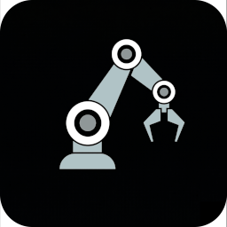

<p align="center">
  
</p>

<h1 align="center">RoboticsStudio</h1>

<p align="center">
  <a href="https://github.com/alfaiajanon/RoboticsStudio/network">
    
  </a>
  <a href="https://github.com/alfaiajanon/RoboticsStudio/stargazers">
    
  </a>
  <a href="https://github.com/alfaiajanon/RoboticsStudio/blob/main/LICENSE">
    
  </a>
  <a href="https://github.com/alfaiajanon/RoboticsStudio/releases">
    
  </a>
</p>

<p align="center"><b>A zero-setup, drag-and-drop robotics simulator powered by MuJoCo.</b></p>

<p align="center">
  
</p>

---

## Why does this exist?

Industry simulators like Gazebo or Isaac Sim assume you are working in an ideal world with perfect, expensive hardware. But students and hobbyists usually work with cheap $3 servos that have gear backlash and noisy sensors.

RoboticsStudio is built for reality. It is a plug-and-play environment where components are pre-configured to behave like the flawed, budget hardware you actually buy. 

Instead of spending a week configuring ROS to test a simple PID loop, you can just drag, drop, and script. Built with C++ and Qt, it runs flawlessly on a standard 8GB laptop without needing a dedicated GPU.

## Download & Run (Zero Setup)

RoboticsStudio is packaged as a standalone AppImage for Linux. No dependencies, no complex installation, no compiling required.

1. Download the latest `.AppImage` from the [Releases page](https://github.com/alfaiajanon/RoboticsStudio/releases/latest).
2. Make it executable:
   ```bash
   chmod +x RoboticsStudio-Linux-x86_64.AppImage
   ```
3. Run it:
   ```bash
   ./RoboticsStudio-Linux-x86_64.AppImage
   ```

## Key Features

* `Visual Assembly:` Drag and drop pre-configured components (Servos, IMUs, structural parts) directly into the scene.
* `Component Library (.rsdef):` Real-world hardware mapped to MuJoCo physics using a simple JSON schema.
* `Script Control:` Write simple, non-blocking JavaScript coroutines to control actuators and read sensors.
* `Live Telemetry:` Built-in multi-axis graphing to visualize raw input and output data in real-time.

## Scripting: Just like Arduino

You don't need to learn a massive API. If you know how to write basic Arduino code, you can simulate your logic here.

```javascript
let servo = comp_1;  // Reference from scene tree
let imu = comp_21;   

function loop() {
    let accel_x = imu.read_accel_x();

    if (accel_x > 2.0) {
        servo.write_angle(45.0);
    } else {
        servo.write_angle(0.0);
    }

    delay(100); // Standard Arduino-equivalent delay
}
```

## Building from Source

If you prefer to compile the application yourself:

```bash
git clone https://github.com/alfaiajanon/RoboticsStudio.git
cd RoboticsStudio
./run.sh
```

## Contributing

RoboticsStudio relies on community-driven hardware profiles. If you have mapped a real-world sensor, motor, or structural piece to an `.rsdef` file and tuned its physical errors, please open a Pull Request to add it to the standard library.