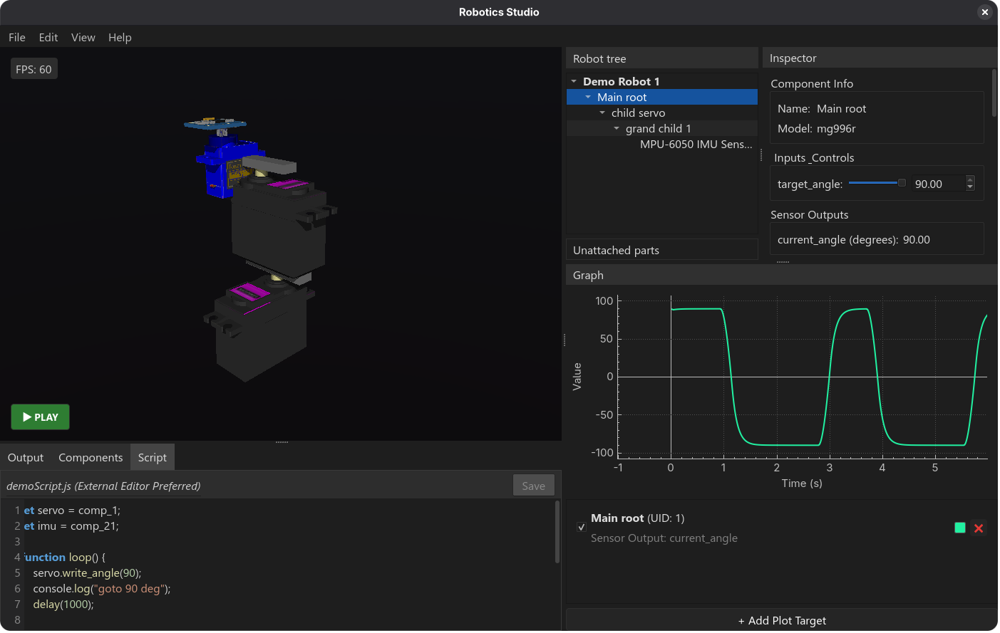

# RoboticsStudio
 
A lightweight, drag-and-drop robotics simulator powered by MuJoCo.

<p align="center">
  
</p>


# Why does this exist?

Industry simulators like Gazebo or Isaac Sim are built for an ideal world with perfect, expensive hardware. But students and hobbyists usually work with cheap $3 servos that have gear backlash and noisy sensors.

RoboticsStudio is built for reality. It is a plug-and-play environment where components are pre-configured to behave like the flawed, budget hardware you actually buy. Instead of spending a week configuring ROS to test a simple PID loop, you can just drag, drop, and script. And because it is a lightweight C++/Qt app, it runs flawlessly on a standard 8GB laptop without needing a dedicated GPU.


# Key Features

- `Visual Assembly`: Drag and drop pre-configured components (Servos, IMUs, structural parts) 
- `Component Library` (.rsdef): Mapped real-world hardware to MuJoCo using a simple JSON (.rsdef) schema. 
- `Script Control`: Write simple, non-blocking JS coroutines to control actuators and read sensors (with arduino like syntax). 
- `Live Telemetry`: Built-in multi-axis graphing to visualize raw input and output data as it happens.


# Scripting: Just like Arduino

You don't need to learn a massive API. If you know how to write basic Arduino code, you can simulate your logic here.


``` js
let servo = comp_1;  // from scene tree
let imu = comp_21;   //        "

function loop() {
    let accel_x = imu.read_accel_x();

    if (accel_x > 2.0) {
        servo.write_angle(45.0);
    } else {
        servo.write_angle(0.0);
    }

    delay(100); // arduino equivalent delay()
}
```


# Getting Started
Download the repo and run the build script `run.sh`
``` bash
git clone https://github.com/alfaiajanon/RoboticsStudio.git
cd RoboticsStudio
./run.sh
```


# Contributing

RoboticsStudio relies on community components. If you have mapped a real-world sensor, motor, or structural piece to an .rsdef file and tuned its real-world errors, please open a Pull Request to add it to the standard library.