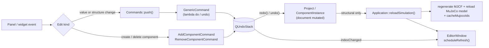

# Command System (Undo/Redo)

Every authored edit made from the UI is a `QUndoCommand` pushed on the single `QUndoStack` owned by `Application` (`getUndoStack()`). `push()` runs `redo()` immediately, so "do" and "redo" share one code path.

Commands never touch widgets. They mutate the document; the simulation reload and UI refresh follow.

## Pieces

| Piece | File | Role |
|---|---|---|
| `GenericCommand` | `Commands/GenericCommand.h` | Lambda-based command: `doFn`, `undoFn`, text, optional merge key, `affectsStructure` flag. |
| `Commands::push()` | `Commands/CommandUtils.h` | Builds a `GenericCommand`; when `requiresReload` is true both lambdas are followed by `reloadSimulation()`. Used by the Inspector and other panels. |
| `AddComponentCommand` | `Commands/AddComponentCommand.h` | Drag-and-drop of a library part onto a connector. |
| `RemoveComponentCommand` | `Commands/RemoveComponentCommand.h` | "Delete Permanently": removes a component and its whole subtree. |
| `Project::takeComponent/adoptComponent`, `takeSubtree/adoptSubtree` | `Document/Project.cpp` | Unlink/relink instances without deleting them, which is what makes undo of add/remove possible. |

## Behaviours worth knowing

- **Merging.** `GenericCommand::id()` is `-1` (never merges) unless a `mergeKey` is given. Commands with the same key collapse: the *first* `undoFn` is kept and the *newest* `doFn` is adopted, so a slider drag becomes one undo step that returns to the original value. Leave the key empty for one-shot actions (attach/detach, buttons).
- **`requiresReload` doubles as `affectsStructure`.**
  - `true` (attach/detach, snap angle, anything changing the MJCF): reload the simulation and refresh the editor.
  - `false` (live value edits such as joint targets): no reload and no rebuild; values sync through the physics loop. Skipping the rebuild avoids stealing widget focus mid-drag. On *undo* of such a command, `EditorWindow` calls `inspector->updateJointValues()` instead. Redo of a value-only command is indistinguishable from a push at the signal level, so the inspector can be stale until the next structural edit or reselection (accepted trade-off).
- **Reloads are coalesced.** `reloadSimulation()` sets a flag and defers via `QTimer::singleShot(0)`; many commands in one event-loop turn cause one reload. It takes `physicsMutex`, calls `project->refresh()`, reloads the model from freshly generated XML, and re-resolves MuJoCo ids.
- **Ownership in Add/Remove.** The command owns the instance (or subtree, including its unparented `Emulator`) only while it is unlinked: *undone* for Add, *done* for Remove. The destructor frees it only in that state (stack cleared, or command dropped past the undo limit). Redo relinks the same object, so uids and emulators are preserved. Parent uid/connector are saved before unlinking and restored before relinking.
- **Detach without deleting** is a plain `Commands::push()` that flips `parentUid`/`parentConnector`; the instance stays in the project as an orphan, so no ownership transfer is needed.
- **Stack lifetime.** `Application` clears the stack whenever a project is opened.
- **Not undoable:** runtime values written by `Simulation/` (actuator targets from scripts, sensor readings).

## Adding a new undoable action

1. Simple edit: capture old and new values in two lambdas and call `Commands::push(doFn, undoFn, "Text", mergeKey, requiresReload)`.
2. Create/destroy objects that must survive undo: write a dedicated `QUndoCommand` following the ownership rule above.
