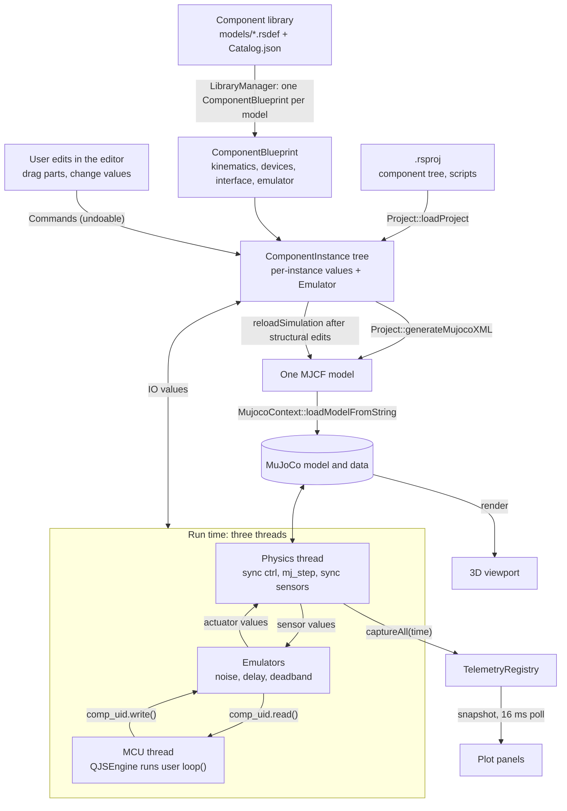

# RoboticsStudio Overview

RoboticsStudio is a desktop robotics simulator (Qt 6, C++17, MuJoCo 3.3.7). A user assembles a robot from library components, writes an Arduino-style JavaScript program, and watches it run in physics with realistic hardware errors and live plots.

## Pipeline

## Stages

1. **Library.** Each component is an `.rsdef` JSON file (see [schema2.md](schema2.md)) listed in `models/Catalog.json`. `LibraryManager` loads one `ComponentBlueprint` per model. A blueprint knows how to emit the MJCF pieces for its component and which signals it exposes.
2. **Project.** An `.rsproj` describes an assembly: component instances linked parent to child through connectors, parameter overrides and script paths. Opening it builds the `ComponentInstance` tree, creates an `Emulator` per instance, and clears the undo stack.
3. **Editing.** The editor mutates the document only through undoable commands ([command.md](command.md)). Structural edits trigger `reloadSimulation()`, which regenerates the whole MJCF from the tree, reloads MuJoCo and re-resolves MuJoCo ids for every signal.
4. **Model generation.** `Project::generateMujocoXML` walks the tree, positions each component through its connector transform and snap angle, and asks each blueprint for body, actuator, sensor, tendon and contact XML. Everything is prefixed `comp_<uid>_` so one model holds many components.
5. **Simulation.** `SimulationManager` has three states:
   - `EDITING`: joint values drive `qpos` and `mj_forward` runs, with no stepping, so parts can be posed. Switching to it stops the script, resets emulators and resets MuJoCo data.
   - `PLAYING`: the physics thread steps the model (scaled by time scale) and the MCU thread runs the script.
   - `PAUSED`: both threads idle.
6. **Signals.** Every component exposes named interface signals (inputs and outputs). Each physics tick: write input values to `ctrl` (degrees converted to radians), `mj_step`, read `sensordata` back into output values (radians to degrees), run each emulator's `update()`.
7. **Scripting.** `MicroController` compiles the user's JavaScript in a `QJSEngine` and calls `loop()` repeatedly on its own thread, throttled to imitate a cheap processor. Each component's emulator is injected as `comp_<uid>`, and its `Q_INVOKABLE` methods (`write`, `read`, ...) are the script API. `delay(ms)` is provided natively.
8. **Observation.** The viewport renders the MuJoCo state. `TelemetryRegistry` sources capture signals and body motion after each batch of steps for the plot panels ([telemetry.md](telemetry.md)).

## Code map

| Folder (`src/`) | Role |
|---|---|
| `Document/` | `Project`, `ComponentData`/`ComponentBlueprint`/`ComponentInstance`, `LibraryManager`, `DeviceTypes`. No widgets. |
| `Commands/` | Undoable edits. The only way the View mutates authored state. |
| `Simulation/` | `SimulationManager` (threads, sync), `MujocoContext`, `MicroController` (JS), `ErrorSystem/` emulators. |
| `Telemetry/` | Registry, sources, storage buffers. |
| `View/` | Windows (launcher, editor, component editor), panels, OpenGL viewports. |
| `Application/` | Singleton that owns the project, simulation manager, editor and undo stack. |

## Threads and locking

| Thread | Work | Shared state |
|---|---|---|
| UI | Qt widgets, commands, plot polling | Mutates the document, reads telemetry |
| Physics | Stepping, signal sync, emulators, telemetry capture | `physicsMutex` guards the MuJoCo model and data; reloads take the same lock |
| MCU | Runs user `loop()` | Talks to components only through emulators and `ComponentInstance` IO values (`ioMutex`) |

Two layering rules: `Document/` and `Simulation/` must not include `Application/Application.h`, and only commands change authored state from the View. Runtime values written by the simulation are not undoable.
