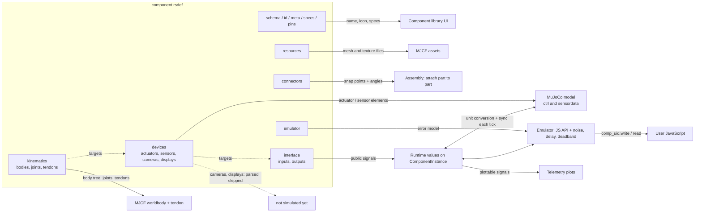

# RSDEF Schema 2

An `.rsdef` file is the JSON definition of one component (servo, IMU, bracket, wheel...). It is listed in `models/Catalog.json`, loaded by `ComponentData::fromJson` and turned into a `ComponentBlueprint`. The loader rejects any file without `"schema": 2`, and rejects schema 1 keys with a hint.

Validation: `schema/rsdef.schema.json` covers structure. Cross-references (unique ids, targets that exist, mass rule) are checked by `ComponentData::fromJson` and mirrored in `python3 tools/validate_rsdef.py [paths]`. Valid device types, target kinds, signal widths and the MJCF element each maps to live in one table: `src/Document/Components/DeviceTypes.cpp`.

## Which part does what



Dotted arrows are references by `target {kind, id}`: signals point at devices (or joints), devices point at physical objects (joints, tendons, sites, geoms). Inside a component that chain is `interface signal -> device -> kinematic object -> MuJoCo`.

## Sections

| Key | Contents | Used for |
|---|---|---|
| `schema` | must be `2` | loader gate |
| `id` | model id, top level (not in `meta`) | `.rsproj` references it |
| `meta` | `name`, `version`, `author`, `icon_path` | library panel |
| `specs` | free-form object (`max_torque_nm`, `voltage_max`, `weight_kg`...) | informational; emulators may read it |
| `pins` | `[{id, description, voltage_range?}]` | declared only; wiring comes later |
| `resources` | `meshes{key: path}`, `materials{key: texture path}` | geoms refer to the keys; paths are relative to the `.rsdef`. Names are prefixed per model when MJCF is generated. |
| `kinematics` | `default_body`, `bodies[]`, `joints[]`, `tendons[]` | physical structure, below |
| `connectors` | `[{id, body, description, transform, mechanics.snap_angles}]` | attach points between components |
| `devices` | `actuators[]`, `sensors[]`, `cameras[]`, `displays[]` (omit empty families) | what MuJoCo drives or measures |
| `interface` | `inputs[]`, `outputs[]` | signals visible to scripts, the Inspector and plots |
| `emulator` | `{type, source, parameters}` | hardware-error model |

## kinematics

- **body**: `id`, `transform {pos, quat}`, `geoms[]`, `sites[]`, `overrideGeom` (default false). `mass` and `inertia` are required when `overrideGeom` is true and forbidden otherwise (then mass comes from the geoms, and a geom `mass` is forbidden when it is true).
- **geom**: `id`, `type` (`mesh`, `box`, ...), `mesh`/`material` resource keys or `color`, `size`, `pos`, `quat`, `mass`.
- **site**: `id`, `transform`. A named point on a body; target for accelerometers, gyros and cameras. Sensors are *not* nested in sites.
- **joint**: `id`, `type`, `body_a`, `body_b`, `transform`, `range`, `damping`, `armature`, `frictionloss`, `collision`. Actuators and sensors are *not* nested in joints.
- **tendon**: `id`, `type: "fixed"` (only), `terms[{joint, coef}]`. A weighted sum of joints, useful for backlash: one sensor measures the total of a drive joint plus a passive gap joint.

Frames: joint and connector transforms are in the **component root frame**. Geom and site transforms are in the **parent body's local frame**. Quaternions are `[w, x, y, z]`.

## devices

Every device has a unique `id` (across all families), a `type`, and a `target {kind, id}`. Multiple devices may target the same object (a joint can have a position and a velocity sensor; two sites at one origin are no longer needed).

| Family | Types | Allowed target kinds | Width | Extra fields |
|---|---|---|---|---|
| actuators | `position`, `velocity`, `motor` | joint, tendon | 1 | `ctrlrange`, `forcerange`, `kp`, `kv` |
| sensors | `jointpos`, `jointvel` | joint | 1 | |
| | `tendonpos`, `tendonvel` | tendon | 1 | |
| | `accelerometer`, `gyro` | site | 3 | |
| cameras | `rgb`, `depth` | site | image | `resolution [w,h]`, `fovy` |
| displays | (no type) | geom | image | `resolution [w,h]` |

Width is fixed by the device type (it matches MuJoCo's `sensor_dim`), so it is never declared by hand. Cameras and displays are validated but skipped by the simulator for now (a log line says so).

## interface

Each signal has a unique `name` (across inputs and outputs), optional `unit`, `physical` (does a real pin or wire carry it, or is it a simulator-only convenience), optional `domain`, optional `componentLabels` for vector legends, and a `target`.

| Direction | Allowed target kinds | Resolves to |
|---|---|---|
| inputs | `joint` | the first actuator that targets that joint (warns if none) |
| | `actuator` | that actuator directly |
| | `display` | a display (not simulated yet) |
| | `emulator` | no MuJoCo object; the emulator owns it |
| outputs | `sensor` | that sensor's data |
| | `camera` | a camera (not simulated yet) |
| | `emulator` | no MuJoCo object; the emulator owns it |

- `domain`: `{"type": "ranged", "parameters": {"min": a, "max": b}}` or `{"type": "unbounded"}` (default). Advisory only: the range of the signal in its own unit.
- `unit`: `degrees` (also `deg`, `degree`) makes the simulator convert to and from radians at the MuJoCo boundary. Any other unit is passed through unchanged.
- `emulator`-kind signals must also give `channel_type` (`scalar` or `vector`) and `dim`. For every other kind these keys are forbidden, because shape and width come from the target device.
- Runtime values are floats only; there is no `data_type`.

## emulator

`type` selects the C++ class in `EmulatorFactory` (`servo_emulator`, `stepper_emulator`, `dc_gear_emulator`, `imu_emulator`, `default_emulator`). An empty type falls back to `default_emulator`. `parameters` is a free-form object read by the emulator (the servo uses `deadband_threshold` and `noise_stddev`, in degrees). `source` is reserved for a custom emulator script and is currently unused.

## Minimal example

A hinge servo: one body pair, a position actuator and sensor, and the two public signals.

```json
{
  "schema": 2,
  "id": "mini_servo",
  "meta": { "name": "Mini Servo", "version": "1.0.0", "author": "me", "icon_path": "icon.png" },
  "resources": { "meshes": {}, "materials": {} },
  "kinematics": {
    "default_body": "base",
    "bodies": [
      { "id": "base", "transform": { "pos": [0,0,0], "quat": [1,0,0,0] },
        "geoms": [{ "id": "base_geom", "type": "box", "size": [0.01,0.01,0.01], "pos": [0,0,0], "quat": [1,0,0,0], "mass": 0.01 }] },
      { "id": "horn", "transform": { "pos": [0,0,0.02], "quat": [1,0,0,0] },
        "geoms": [{ "id": "horn_geom", "type": "box", "size": [0.01,0.002,0.001], "pos": [0,0,0], "quat": [1,0,0,0], "mass": 0.001 }] }
    ],
    "joints": [
      { "id": "hinge", "type": "hinge", "body_a": "base", "body_b": "horn",
        "transform": { "pos": [0,0,0.02], "quat": [1,0,0,0] }, "range": [-90, 90], "damping": 0.01 }
    ]
  },
  "connectors": [
    { "id": "base", "body": "base", "description": "bottom", "transform": { "pos": [0,0,-0.01], "quat": [0,1,0,0] },
      "mechanics": { "snap_angles": [0, 90, 180, 270] } }
  ],
  "devices": {
    "actuators": [{ "id": "motor", "type": "position", "target": { "kind": "joint", "id": "hinge" },
                    "ctrlrange": [-90, 90], "forcerange": [-0.2, 0.2], "kp": 5, "kv": 0.5 }],
    "sensors": [{ "id": "pos", "type": "jointpos", "target": { "kind": "joint", "id": "hinge" } }]
  },
  "interface": {
    "inputs": [{ "name": "target_angle", "unit": "degrees", "physical": true,
                 "domain": { "type": "ranged", "parameters": { "min": -90, "max": 90 } },
                 "target": { "kind": "joint", "id": "hinge" } }],
    "outputs": [{ "name": "current_angle", "unit": "degrees", "physical": false,
                  "target": { "kind": "sensor", "id": "pos" } }]
  },
  "emulator": { "type": "servo_emulator", "source": null, "parameters": { "noise_stddev": 1 } }
}
```

For complete real files see `models/servo/servo_sg90/servo_sg90.rsdef` (servo) and `models/imu/imu_mpu6050/imu_mpu6050.rsdef` (accelerometer + gyro).
