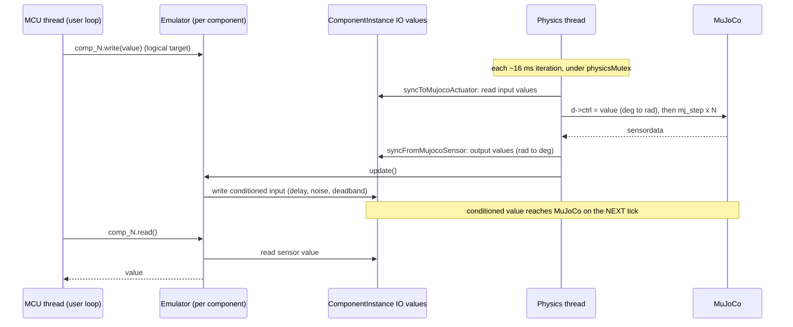

# Sim-to-Real: Error Simulation, Emulators and Script Injection

"Sim-to-real" is the right term for this topic. The *sim-to-real gap* is the difference between how a controller behaves in simulation and on real hardware; code tuned against a perfect simulator often fails on a $3 servo with backlash, noisy readings and latency. RoboticsStudio narrows that gap on purpose by injecting hardware imperfections, so a script that works here has a better chance of working on the bench. (The technique itself is usually called error or noise injection, or hardware non-ideality modelling.)

Imperfection is added at three independent layers:

| Layer | Where | Models | Defined in |
|---|---|---|---|
| Physics | MuJoCo model | friction, damping, rotor inertia, torque limits, backlash, mass | `kinematics` and `devices` of the `.rsdef` |
| Signal | `Emulator` (C++) | command delay, noise, deadband, PWM and unit semantics, the script-facing API | `emulator` of the `.rsdef` + C++ class |
| Timing | `MicroController` (JS) | slow single-threaded processor, blocking `delay()`, no parallelism | `MicroController` |

## One tick of the loop



Consequences worth knowing:

- The script never writes to MuJoCo directly. `write()` stores a *logical* target inside the emulator; `update()` turns it into the value the physics sees.
- `update()` runs once per physics iteration (after a batch of `mj_step` calls), not once per `mj_step`, and the result is applied on the following iteration. This adds one iteration of latency on top of any modelled delay.
- Output values are what the *sensor* reports. Emulators can post-process them in `read` methods before handing them to the script.
- Switching to Edit mode calls `reset()` on every emulator and resets MuJoCo state. Pressing Play calls `init()` (re-reads parameters) and recompiles the script.

## Layer 1: physics fidelity

Set in the component file ([schema2.md](schema2.md)); no C++ needed:

- **Joint**: `damping`, `armature` (rotor inertia), `frictionloss`, `range`.
- **Actuator**: `forcerange` (stall torque limit), `ctrlrange`, `kp`/`kv` (a `position` actuator is a PD controller, so it has finite stiffness and overshoot).
- **Mass**: per-geom `mass`, or `overrideGeom` with explicit `mass`/`inertia`.
- **Backlash**: put a loose passive joint in series with the driven joint (small `range`, low damping, `collision: false`), and add a `fixed` tendon summing both with a `tendonpos` sensor. The drive joint moves, the gap joint lets the output wander, and the tendon sensor reports the total angle. Schema 2 allows several sensors per joint and sensors on tendons for exactly this.

## Layer 2: the emulator system (error injection)

An `Emulator` is a `QObject` created per `ComponentInstance` by `EmulatorFactory::create(type, comp)`, using the `emulator.type` from the `.rsdef` (empty type gives `default_emulator`; unknown types are logged as errors and the component gets no emulator).

```cpp
class Emulator : public QObject {
    virtual void init();    // Play pressed: read parameters from emulatorDef
    virtual void update();  // every physics iteration: apply error model, write actuator values
    virtual void reset();   // Edit pressed: clear internal state
};
```

Subclasses add `Q_INVOKABLE` methods; those are the script API for that component. Parameters come from `emulator.parameters` in the `.rsdef` via `component->getBlueprint()->emulatorDef.parameters`, so a different part (SG90 vs MG996R) is the same class with different numbers.

Registered types and what is actually implemented today:

| `type` | Script API | Error model implemented | Declared but not yet used |
|---|---|---|---|
| `servo_emulator` | `write(deg)`, `read()` | **deadband** (`deadband_threshold`, degrees) and **Gaussian noise** (`noise_stddev`, degrees) on the target | `delay_ms` (documented in the class comment, no delay buffer exists) |
| `dc_gear_emulator` | `set_pwm(-255..255)`, `brake()`, `read_velocity()` | PWM clamped to the 8-bit range; the value is forwarded to the `target_velocity` input | `max_rpm_at_12v`, `deadband_pwm`, `acceleration_delay_ms`: the PWM-to-velocity, deadband and ramp code is commented out |
| `stepper_emulator` | `set_velocity(rad/s)`, `set_rpm(rpm)`, `stop()`, `read_position()`, `read_velocity()` | none (smooth pass-through of the requested velocity) | `step_angle_deg`, `microstepping`, `holding_torque_factor` |
| `imu_emulator` | `getAcceleration()`, `getRotation()` (objects with `x`,`y`,`z`) | none (returns the raw sensor values) | `noise_stddev`, `delay_ms` |
| `default_emulator` | none | none | |

So today the physics layer carries most of the realism, and the servo is the only part with real signal-level error injection. The other parameters are placeholders for planned models.

### Adding an error model

1. Write a class deriving from `Emulator` in `Simulation/ErrorSystem/`, implement `init/update/reset`, and expose script methods with `Q_INVOKABLE`.
2. Register it in `EmulatorFactory::create`.
3. Set `emulator.type` and `emulator.parameters` in the `.rsdef`. Read parameters in `init()`.
4. Keep errors on the signal path in causal order. The servo's order is: command, deadband, noise, effective target.
5. Signal names used in `getActuatorValue/getSensorValue` must match `interface` signal names in the `.rsdef`. Those lookups never fail loudly (a missing key returns an empty default value), so a typo shows up as dead behaviour.

Signals with `target.kind: "emulator"` in `interface` are values owned by the emulator itself (for example a battery voltage) rather than by a MuJoCo object.

## Layer 3: MCU code injection and timing

`MicroController` hosts the user's JavaScript in a `QJSEngine` and imitates a small microcontroller.

**Injection.** On Play, `compile(script, root)` walks the component tree and publishes each emulator to the engine as a global named `comp_<uid>` (uid is shown in the scene tree). It also defines `console.log()` (to the output panel) and `delay(ms)`. The script is then evaluated, and a global `loop` function must exist.

```javascript
let servo = comp_1;
let imu = comp_21;

function loop() {
    let a = imu.getAcceleration();
    servo.write(a.x > 2.0 ? 45 : 0);
    delay(100);
}
```

**Execution.** The MCU thread calls `loop()` over and over with a 1 ms pause between calls (a throttle to mimic a cheap processor). Everything runs on this one thread, like Arduino: no preemption and no parallelism.

**`delay(ms)`.** Native and blocking. It sleeps in chunks of at most 15 ms and busy-yields for the final 1-2 ms, checking the stop flag throughout so Pause/Edit interrupt it immediately. It uses wall-clock time, not simulated time, so a time-scale other than 1 changes how many simulated seconds a `delay` covers. A drift in plotted timing from this is a known `[TODO]` in the source.

**Stopping and errors.** `stop()` sets a flag and interrupts the engine, which aborts a script stuck in a busy loop. A compile error, a missing `loop()`, or a runtime error is logged and the script stops running (`isCompiled = false`) until the next Play.

## Threading notes

- `write()` runs on the MCU thread and updates the emulator's logical target; `update()` reads it on the physics thread. These are plain doubles, not atomics, so the hand-off is a benign data race today.
- Component IO values themselves are protected by `ComponentInstance::ioMutex`.

## Known issues

- The `README.md` scripting example uses `read_accel_x()`, which does not exist on `imu_emulator`; the real API is `getAcceleration()`/`getRotation()`.
