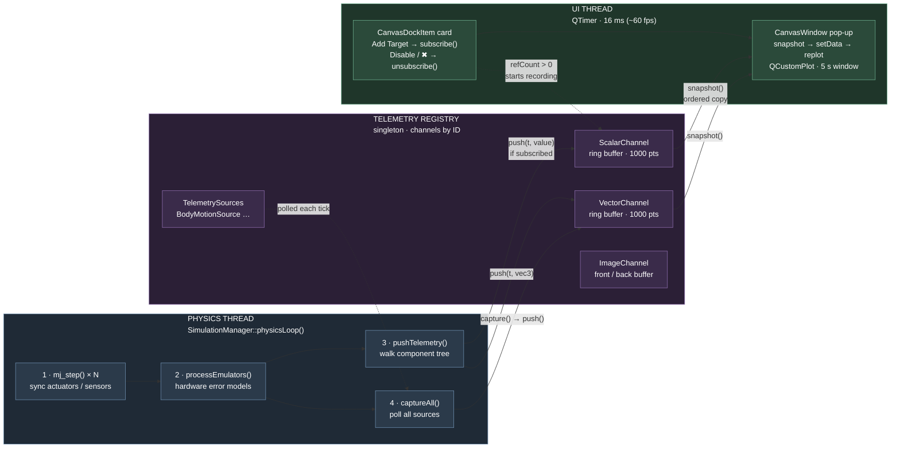
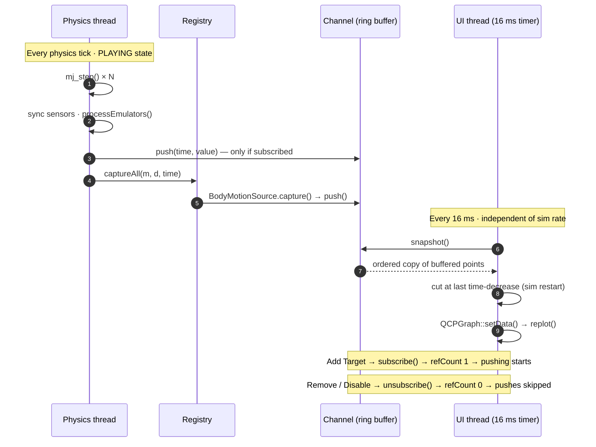

# Telemetry & Plotting

How simulation data gets from MuJoCo to the graphs you see in the Plot panel.

Core code: `src/Telemetry/`. Consumers: `src/View/Panels/` (`PlotPanel`, `Canvas`, `MotionPanel`).

## The big picture

```
Producers (physics thread)          Registry (shared hub)          Consumers (UI thread)
─────────────────────────           ─────────────────────          ─────────────────────
ComponentInstance IO streams  ──┐
  pushed by SimulationManager   │   TelemetryRegistry singleton      CanvasDockItem cards
BodyMotionSource (body motion) ─┼─►  map<int id, shared_ptr<Channel>>  ──► CanvasWindow pop-ups
                                │                                    (QCustomPlot, 16 ms timer)
                                └──► subscribe()/unsubscribe() gates pushing
```

Data flows **push → buffer → poll**:

1. Producers write into **Channels** (ring buffers) from the physics thread.
2. Channels live in the **TelemetryRegistry** singleton, keyed by a small integer ID.
3. The UI holds channel IDs, calls `snapshot()` on a 16 ms timer, and draws with QCustomPlot.

A channel only stores data while someone is **subscribed** (`refCount > 0`). No subscribers = `push()` returns immediately = zero cost for unwatched signals.

## Channels (`Channel.h`, `TelemetryRegistry.cpp`)

A channel = metadata + a thread-safe buffer. Three concrete types:

- **`ScalarChannel`** — one `double` per time step. Fixed-size ring buffer (default 1000 points). `push(time, value)` writes at `head` and wraps. `snapshot()` returns an ordered copy, oldest → newest, skipping empty (`time <= 0`) slots.
- **`VectorChannel`** — same, but each point is a `std::vector<double>` of fixed `dim` (e.g. 3 for XYZ). Pushes with a wrong dimension are dropped.
- **`ImageChannel`** — no history; a front/back buffer pair. `push()` overwrites the back buffer and sets a flag; `snapshot()` swaps and returns `true` only when a new frame arrived. (Registered but no UI consumer yet — the "Image" canvas type exists only as an icon.)

Every channel carries `ChannelMeta`: `name` (UI label, e.g. `comp_3.angle`), `source` (`INPUT`, `OUTPUT`, `MCU`, `BODY_MOTION`, `CUSTOM`), `physical` flag, and `dim`.

Subscription counting is atomic (`subscribe()` / `unsubscribe()` / `isActive()`), while buffer access is mutex-protected — so the physics thread and UI thread never corrupt each other.

## TelemetryRegistry (`TelemetryRegistry.h/.cpp`)

Global singleton (`TelemetryRegistry::getInstance()`). Owns:

- three maps: `id → shared_ptr<ScalarChannel|VectorChannel|ImageChannel>`;
- a list of `TelemetrySource`s.

Key methods:

- `registerScalar/Vector/Image(meta)` → creates the channel, returns its ID.
- `getScalar/getVector/getImage(id)` → look up a channel (nullptr if missing).
- `getChannelsOfType(type)` → all IDs of one kind; used to fill "Add Target" dialogs.
- `addSource()` / `removeSource(channelId)` / `captureAll(m, d, time)` — the producer-side hook (see below).
- `clear()` — wipes everything and resets IDs to 1. **Currently never called** (project reload leaks/reuses channels — known gap).

## Where the data comes from

There are two producer paths, both running on the **physics thread** while `SimulationManager::physicsMutex` is held.

### 1. Component I/O channels

When a `ComponentInstance` is created, `initializeIO()` (`src/Document/Components/ComponentInstance.cpp:51`) walks the blueprint's `inputDefs` (actuator commands) and `outputDefs` (sensor readings) and registers one channel per I/O key. Each `IOStream` holds the `channelId` plus the live values (`targetData` / `currentData`).

Each physics tick, `SimulationManager::physicsLoop()` (`src/Simulation/SimulationManager.cpp:195`):

1. syncs actuator targets → MuJoCo, steps physics, syncs sensors ← MuJoCo;
2. runs emulators (`processEmulators`) — they apply the "cheap hardware" error models;
3. calls `pushTelemetry(root, time)` (line 294), which recursively reads every actuator `targetData` and sensor `currentData` and pushes them into their registered scalar/vector channels.

So an "I/O channel" simply mirrors the component's current I/O values, once per physics tick, at MuJoCo sim time.

### 2. TelemetrySources

`TelemetrySource` (`TelemetrySource.h`) is an interface: `channelId()`, `description()`, and `capture(m, d, time)`. Registered sources get `captureAll()` called right after `pushTelemetry()` each tick (line 227).

The only implementation today is **`BodyMotionSource`** (`BodyMotionSource.cpp`): it registers a dim-3 vector channel for itself, then on each capture calls `mj_objectVelocity` or `mj_objectAcceleration` for one MuJoCo body (named `comp_<uid>_<bodyName>`, resolved lazily on first capture) and pushes the angular or linear 3-tuple, in world or local frame.

This is the extension point for new telemetry kinds (forces, energy, …): subclass `TelemetrySource`, register a channel in the constructor, feed it in `capture()`.

## The UI side

### PlotPanel (`PlotPanel.cpp`)

Just a `QTabWidget` (tabs on the west side) with two tabs:

- **"I/O"** — a scrollable list of `CanvasDockItem` cards plus a pinned "+ Add Canvas" button. The button opens a dialog (name + data type) and appends a new card.
- **"Motion"** — a `MotionPanel` (body motion plots).

### CanvasDockItem = the card (`Canvas.cpp:432`)

A card represents one plot for one data type. Buttons:

- **+ Add Target** — dialog listing all registry channels of the card's type (minus already-added ones). Picking one: remembers the ID, calls `channel->subscribe()` (starts recording), adds a graph to the pop-up window, and adds a removable row to the card.
- **View** — shows the hidden pop-up `CanvasWindow`.
- **Disable/Enable** — `unsubscribe()`/`subscribe()` all its channels (pauses recording without losing the setup).
- **✖** — unsubscribes everything and destroys card + pop-up. Removing a single target row does the same for one channel.

### CanvasWindow = the pop-up plot (`Canvas.cpp`)

Created alongside its card, shown on demand. Two implementations:

- **`ScalarCanvasWindow`** — one QCustomPlot; each target = one `QCPGraph` with a random color (changeable via a color button in the side panel).
- **`VectorCanvasWindow`** — three display modes via a combo box: "Decomposed" (X/Y/Z as solid/dash/dot lines on one plot), "Decomposed (Separate)" (three stacked plots), and "Axis" (placeholder, unimplemented). Each target owns 6 graphs.

Both run a `QTimer` at 16 ms (~60 fps). Each timeout:

1. `snapshot()` every active channel;
2. cut the data at the last time-decrease (detects sim restarts so old data isn't drawn as a backwards jump);
3. `setData()` on the graphs;
4. if new data arrived, scroll the X axis to a 5 s window ending at the latest sim time, rescale Y, replot.

### MotionPanel (`MotionPanel.cpp`)

The Motion tab's "+ Add Target" dialog lets you pick component → body → quantity (linear/angular velocity/acceleration) → world/local frame. It creates a `BodyMotionSource`, registers it with `registry.addSource()`, subscribes its channel, and points a shared `VectorCanvasWindow` ("Body Motion") at it. Removing a row unsubscribes and `removeSource()`s it.

### PlotTarget (`PlotTarget.h`)

A small struct (`compUid`, SENSOR/ACTUATOR, `ioKey`, color, visibility) — an older/planned abstraction for "what to plot". The current UI works directly with channel IDs instead; nothing references it.

## Threading & lifecycle cheat-sheet

- Producers push only from the physics thread, under `physicsMutex`.
- Channels: atomic refcount + per-channel buffer mutex → safe cross-thread hand-off via `snapshot()` copies.
- UI polls at 16 ms regardless of sim rate; the channel ring buffer (1000 points) is the decoupling cushion.
- Channel recording starts/stops purely through subscribe/unsubscribe — the registry and channels themselves live forever (until `clear()`, which is currently never invoked).

## Visual workflow (Mermaid)

Paste the blocks below into [mermaid.live](https://mermaid.live) to see them rendered.

### 1. The pipeline at a glance



### 2. One tick, end to end


