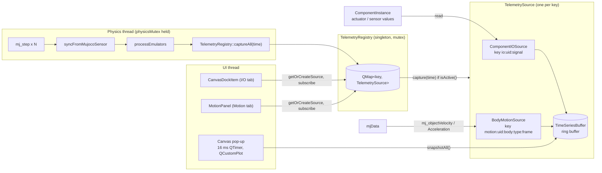

# Telemetry & Plotting

How simulation data gets from MuJoCo to the plots. Code: `src/Telemetry/` (producers, registry, storage) and `src/View/Panels/` (`PlotPanel`, `Canvas`, `MotionPanel`).

## Flow

1. **Create.** A panel asks `getOrCreateSource(key, factory)`; the registry returns the existing source or builds one with the factory. Keys are plain strings, so two plots of the same signal share one source.
2. **Subscribe.** Each user of a source calls `subscribe()` (atomic ref-count). `capture()` returns immediately while `isActive()` is false, so unwatched signals cost nothing. Disabling a canvas unsubscribes its sources; deleting it does too.
3. **Capture.** After every batch of physics steps the physics thread calls `captureAll(sim time)`, and each active source pushes one sample.
4. **Poll.** Canvas windows run a 16 ms `QTimer`, call `snapshotAll()` (an ordered copy of the ring buffer, returned as `std::any` holding `std::vector<TimeSeriesDataPoint>`) and redraw.

## Pieces

| Piece | Role |
|---|---|
| `TelemetrySource` | Abstract producer: `key`, `name`, `description`, `DataType` (`SCALAR`/`VECTOR`/`IMAGE`), ref-count, `capture(time)`, `snapshotAll()`. Subclass it to add a telemetry kind. |
| `ComponentIOSource` | Plots one interface signal of a component (`isInput` selects `getActuatorValue` vs `getSensorValue`). Width comes from `ComponentBlueprint::interfaceDim`; image signals (dim 0) are not offered yet. Buffer: 100 points. Storage is a `variant<TimeSeriesBuffer, ImageBuffer>`; the image branch of `capture()` is a stub (camera/display not supported yet). |
| `BodyMotionSource` | Linear/angular velocity or acceleration of one MuJoCo body (`comp_<uid>_<body>`), global or local frame. Uses `mj_objectVelocity`/`mj_objectAcceleration` (result is `[angular(3); linear(3)]`). The body id is resolved lazily on the first capture because the model can be reloaded. Dim 3, buffer 1000 points. |
| `TimeSeriesBuffer` | Mutex-protected ring buffer of `(time, vector<double>)`. `push` silently drops a vector whose width differs from the buffer's `dim`. `snapshot()` returns the raw ring contents and does not unwrap it; the plot code finds the wrap point where time goes backwards. `pullNewData(cursor)` returns only the points added since the cursor. |
| `ImageBuffer` | Front/back `QImage` pair, reserved for camera/display. No UI consumer yet. |
| `TelemetryRegistry` | Owns all sources. `clearAll()` (currently only called from the `MotionPanel` destructor); `clearInactive()` drops sources with no subscribers (called when a Motion target is removed). |

## UI

- **I/O tab** (`PlotPanel`): "+ Add Canvas" creates a `CanvasDockItem` card with a pop-out `ScalarCanvasWindow` or `VectorCanvasWindow`. Its "add target" dialog lists every non-image input/output signal of every component in the project, as `io:<uid>:<signal>` sources.
- **Motion tab** (`MotionPanel`): pick component, body, quantity and frame to create a `motion:` source plotted in a vector canvas.

## Caveats

- `clearInactive()` is not yet called when a canvas target is removed from the I/O tab (a `[TODO]` in `Canvas.cpp`), so unsubscribed sources linger in the registry. They are inactive and therefore free.
- `ComponentIOSource` holds a raw `ComponentInstance*` and nothing invalidates registry keys when components are deleted or a project is reopened, so a stale source can outlive its component.
- The commented-out channel-id code in `TelemetryRegistry.cpp` is the previous design and is dead.
